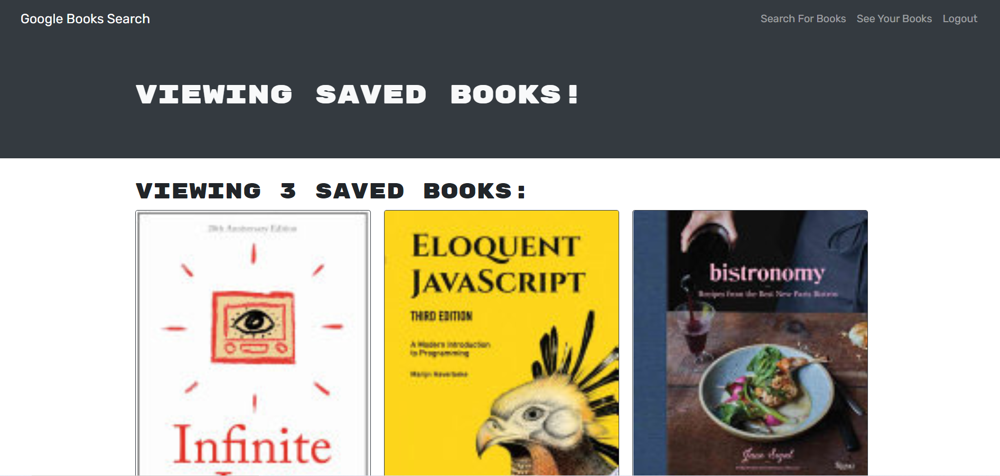

## Google Books Search

[Visit Site](https://sleepy-beach-66862.herokuapp.com/)

## Description

A full-stack MERN application that allows users to search the Google Books database by book title.  A user can sign up to be able to save books to a collection which they can access on future visits to the site after a successful log in.

## Table of Contents
  * [Installation](#installation)
  * [Usage](#usage)
  * [License](#license)
  * [Contributing](#contributing)
  * [Testing](#testing)
  * [Questions](#questions)
  
## Installation
Clone project to a directory on your local machine and cd into the google-books-search directory.  Run <$ npm install> to load all dependencies.  Run <$ npm start> to launch a development server on localhost port 3000.

## Usage
Enter the title of a book in the search bar to see information about the book, including a link to the book on Google Books.  Click on the login/signup button in the navigation to open a form that will allow to do both of those actions. Provide credentials to access additional features.  Click on the Save Book button for any book you wish to add to your collection.  To view your collection of saved books, click the See Your Books button in the navigation.  From this view, you can delete any of the books you wish to.

## License 
This project is covered under the MIT license 

## Contributing
To see the guidelines adopted for contributing to this project, please view the [Contributor Covenant](https://www.contributor-covenant.org/version/2/0/code_of_conduct/code_of_conduct.txt)

## Testing
Tests coming soon

## Questions
Visit me at GitHub  
[osadenaike](https://github.com/osadenaike)
  
If you have any questions or would like to contact me, please email me at  
[osadenaike@gmail.com](mailto:osadenaike@gmail.com)
